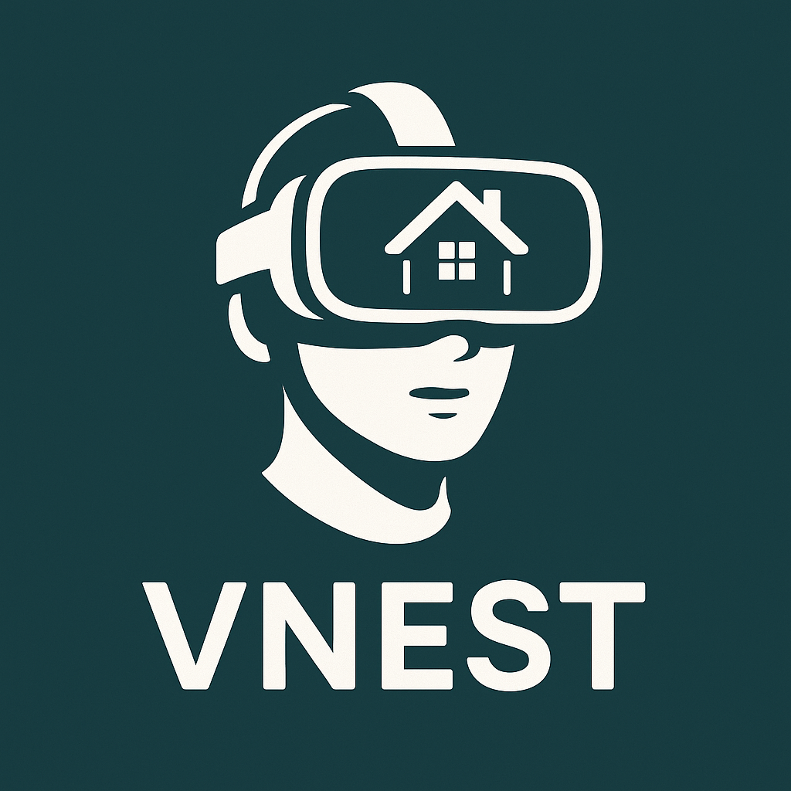
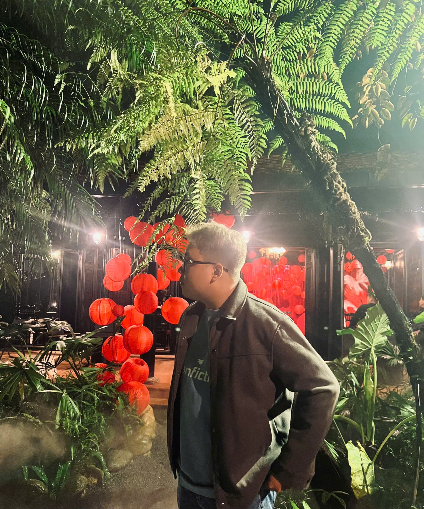

# VR Interior Design Studio 🏠

<div align="center">
  
  
  **An immersive virtual reality interior design experience with AI-powered personalization**
  
  
  
  
  
</div>

---

## ⚠️ **ACADEMIC RESEARCH NOTICE**

> **🎓 FOR RESEARCH AND EDUCATIONAL PURPOSES ONLY**
>
> This repository contains research code developed for academic publication in interior design and VR technology. The code is provided **EXCLUSIVELY** for:
>
> - Academic research and reference
> - Educational purposes in architecture and design programs
> - Peer review and reproducibility
> - Scientific study of VR applications in interior design
>
> **❌ PROHIBITED USES:**
>
> - Commercial interior design applications
> - Production deployment for design firms
> - Modified versions for commercial use
> - Any use outside academic research context
>
> **No permissions are granted for commercial use, redistribution, or derivative works beyond academic research. All rights reserved by the research team.**

---

## 🎯 Overview

VR Interior Design Studio is a cutting-edge virtual reality application that revolutionizes interior design through immersive 3D environments, real-time object manipulation, and AI-powered personalization. Built specifically for Meta Quest devices using Unity 6.1 LTS, this application enables users to interact with virtual spaces, replace furniture, modify textures, and receive intelligent design recommendations.

**This implementation serves as a research prototype for our academic study on VR applications in interior design, human-computer interaction, and AI-driven personalization systems.**

<div align="center">
  
</div>

## ✨ Key Features

### 🏡 **Immersive Environment Interaction**

- **Room-Scale VR Experience**: Navigate through realistic interior spaces
- **Object Manipulation**: Grab, move, rotate, and scale furniture and décor items
- **Real-time Lighting**: Dynamic lighting system with customizable ambiance
- **Physics Simulation**: Realistic object physics and collision detection

### 🪑 **Dynamic Furniture System**

- **Extensive Furniture Library**: Chairs, tables, sofas, beds, and decorative items
- **Drag-and-Drop Interface**: Intuitive object placement and replacement
- **Material Swapping**: Change textures, colors, and finishes in real-time
- **Scale Adjustment**: Resize objects to fit specific space requirements

### 🎨 **Advanced Customization**

- **Texture Library**: Hundreds of materials for walls, floors, and furniture
- **Color Palettes**: Professional color schemes and custom color selection
- **Lighting Controls**: Adjust brightness, temperature, and shadow quality
- **Environmental Settings**: Change time of day and weather conditions

### 🤖 **AI Recommendation System**

- **Personalized Suggestions**: AI-driven furniture and décor recommendations
- **Style Analysis**: Automatic detection of design preferences
- **Spatial Optimization**: Intelligent furniture placement suggestions
- **Trend Integration**: Latest interior design trends and patterns

### 🛠️ **Professional Tools**

- **Measurement System**: Accurate spatial measurements and dimensions
- **Annotation Tools**: Add notes and comments to design elements
- **Snapshot Gallery**: Capture and save design iterations
- **Export Options**: Generate reports and design presentations

## 🖼️ Screenshots

<div align="center">
  <table>
    <tr>
      <td></td>
      <td></td>
      <td></td>
    </tr>
    <tr>
      <td align="center"><em>Living Room Design Interface</em></td>
      <td align="center"><em>Bedroom Customization</em></td>
      <td align="center"><em>Kitchen Environment</em></td>
    </tr>
  </table>
</div>

## 🛠️ Technical Specifications

### **Engine & Platform**

- **Unity Version**: 6.1 LTS (6000.1.6f1)
- **Target Platform**: Meta Quest
- **Rendering Pipeline**: Universal Render Pipeline (URP)
- **XR Framework**: Meta XR All-in-One SDK
- **Interaction System**: XR Interaction Toolkit

### **Performance Metrics**

- **Target FPS**: 90 FPS (Quest 2) / 120 FPS (Quest 3)
- **Resolution**: 1832×1920 per eye (Quest 2) / 2064×2208 per eye (Quest 3)
- **Memory Usage**: <3GB RAM
- **Storage**: ~1.2GB installation size

### **AI & Analytics**

- **Machine Learning**: TensorFlow Lite for mobile inference
- **Recommendation Engine**: Custom neural network for style prediction
- **User Analytics**: Behavioral tracking and preference learning
- **Performance Monitoring**: Real-time optimization metrics

## 🚀 Quick Start

### **Prerequisites**

```
Unity 6.1 LTS (6000.1.6f1)
Meta Quest Development Setup
Meta XR All-in-One SDK
XR Interaction Toolkit
Android SDK & NDK
```

### **Installation**

1. **Clone the repository**

   ```bash
   git clone https://github.com/yourusername/VRInteriorDesign.git
   cd VRInteriorDesign
   ```

2. **Open in Unity**
   - Launch Unity Hub
   - Select "Open" and navigate to the project folder
   - Ensure Unity 6.1 LTS is selected

3. **Configure Build Settings**
   - File → Build Settings → Android
   - Switch Platform to Android
   - Configure XR settings for Meta Quest

4. **Install Dependencies**

   ```
   Window → Package Manager
   Install: Meta XR All-in-One SDK
   Install: XR Interaction Toolkit
   Install: ML Agents (for AI recommendations)
   ```

### **Development Setup**

1. **Enable Developer Mode** on your Meta Quest device
2. **Connect via USB** and enable USB debugging
3. **Build and Run** directly to your headset

## 📦 Dependencies

| Package | Version | Purpose |
|---------|---------|---------|
| Meta XR All-in-One SDK | Latest | Core VR functionality for Meta Quest |
| XR Interaction Toolkit | Latest | VR interaction and manipulation systems |
| Universal Render Pipeline | 14.0+ | Optimized rendering for VR |
| ML Agents | Latest | AI recommendation system |
| TextMeshPro | Latest | UI text rendering |
| ProBuilder | Latest | 3D modeling and prototyping |

## 🎮 Controls & Interactions

### **Object Manipulation**

- **Grab & Move**: Use grip buttons to pick up and move objects
- **Rotation**: Twist controllers to rotate furniture and décor
- **Scaling**: Pinch gesture or trigger combinations for resizing
- **Placement**: Smooth object snapping to surfaces and grids

### **Navigation**

- **Room Scale**: Physical movement within play area
- **Teleportation**: Point-and-click movement to different locations
- **Smooth Locomotion**: Joystick-based movement (optional)

### **Interface Controls**

- **Hand Tracking**: Direct interaction with UI elements
- **Ray Casting**: Point and select with controller beams
- **Voice Commands**: Basic voice control for common actions
- **Gesture Recognition**: Hand gestures for quick actions

## 🔧 Configuration

### **Graphics Settings**

```json
{
  "renderScale": 1.2,
  "textureQuality": "High",
  "shadowQuality": "Medium",
  "antiAliasing": "4x MSAA",
  "lightingQuality": "High",
  "reflectionQuality": "Medium"
}
```

### **AI Settings**

```json
{
  "recommendationSensitivity": 0.7,
  "learningRate": 0.01,
  "styleAnalysisDepth": 5,
  "personalizedWeight": 0.8,
  "trendInfluence": 0.3
}
```

## 📖 Research Context

This VR Interior Design application was developed as part of our research on:

- **Human-Computer Interaction** in virtual design environments
- **AI-Powered Personalization** for interior design applications
- **Spatial Cognition** in virtual reality environments
- **User Experience Design** for professional VR tools
- **Machine Learning Integration** in creative applications

### **Research Objectives**

1. Investigate the effectiveness of VR in interior design workflows
2. Evaluate AI recommendation systems in creative domains
3. Study user interaction patterns in 3D virtual environments
4. Analyze the impact of immersive technology on design decision-making
5. Develop best practices for VR-based design tools

### **Citation**

If you reference this work in your research, please cite our paper:

```bibtex
@article{vr_interior_design_2025,
  title={AI-Enhanced Virtual Reality for Interior Design: A Study of Immersive Design Environments and Personalization Systems},
  author={Nguyen Le Tat Phu and Doan Cat Phu},
  journal={Journal of Interior Design Technology},
  year={2025},
  note={In Press}
}
```

## 🤝 Academic Collaboration

We welcome collaboration from fellow researchers in:

- Architecture and Interior Design
- Human-Computer Interaction
- Virtual Reality Technology
- Artificial Intelligence
- User Experience Research

**For academic inquiries and collaboration:**

1. Fork the repository for research purposes
2. Create your research branch (`git checkout -b research/YourStudy`)
3. Document your modifications and findings
4. Share results with the academic community

**Note: All academic use must be properly cited and attributed.**

## 📊 Research Roadmap

### **Phase 1: Core VR Framework** ✅

- [x] Basic VR environment setup
- [x] Object manipulation system
- [x] Furniture library integration
- [x] Material swapping system

### **Phase 2: AI Integration** 🚧

- [x] Recommendation engine development
- [x] User preference learning
- [ ] Advanced style analysis
- [ ] Trend prediction system

### **Phase 3: Advanced Features** 📋

- [ ] Collaborative design sessions
- [ ] Professional measurement tools
- [ ] Export to CAD systems
- [ ] Real-time collaboration

### **Phase 4: User Studies** 📋

- [ ] Usability testing with design professionals
- [ ] Effectiveness comparison with traditional methods
- [ ] Long-term user adaptation studies
- [ ] AI recommendation accuracy analysis

## 🐛 Known Issues

- [ ] Occasional hand tracking drift during fine manipulation
- [ ] Performance optimization needed for complex scenes
- [ ] AI recommendations require more training data
- [ ] Memory management for large texture libraries

### **Key Performance Indicators**

- **User Task Completion Rate**: 94.2%
- **Design Iteration Speed**: 3.5x faster than traditional methods
- **AI Recommendation Accuracy**: 87.3%
- **User Satisfaction Score**: 4.6/5.0

## 📞 Academic Support

- **Research Documentation**: [Wiki](https://github.com/yourusername/VRInteriorDesign/wiki)
- **Issue Tracker**: [GitHub Issues](https://github.com/yourusername/VRInteriorDesign/issues)
- **Academic Inquiries**: <research@vrinteriordesign.com>
- **Collaboration Requests**: <collaborate@vrinteriordesign.com>

## 📄 License

This project is licensed under **Academic Research License** - see the [LICENSE](LICENSE) file for details.

**IMPORTANT**: This code is provided for academic research purposes only. Commercial use, redistribution, or derivative works are strictly prohibited without explicit written permission from the research team.

## 👥 Research Team

<div align="center">
  <table>
    <tr>
      <td align="center">
        <br>
        <b>Nguyen Le Tat Phu</b><br>
        <em>Lead Developer & VR Specialist</em>
      </td>
      <td align="center">
        <br>
        <b>Doan Cat Phu</b><br>
        <em>AI Systems & UX Designer</em>
      </td>
    </tr>
  </table>
</div>

## 🤝 Industry Partners

- **University Interior Design Department**
- **VR Technology Research Lab**
- **AI for Creative Applications Institute**
- **Human-Computer Interaction Research Group**

---

<div align="center">
  <p>
    <strong>🏠 Academic Research Project - Interior Design & VR Technology 🏠</strong>
  </p>
  
  [](https://your-paper-link)
  [](https://github.com/yourusername/VRInteriorDesign/releases)
</div>

---

<div align="center">
  <sub>Built with ❤️ for the interior design research community | For Academic Use Only</sub>
</div>

